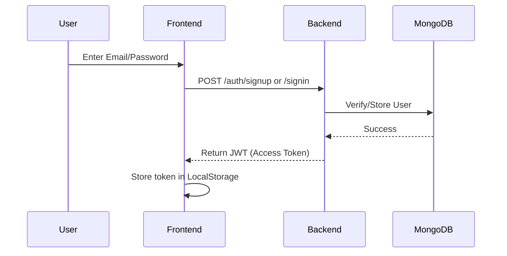
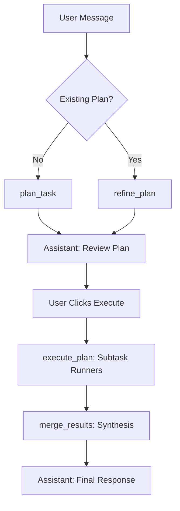

# Koala — AI Orchestrator API Documentation

Welcome to the official API documentation for the Koala AI Orchestrator. This document provides a detailed reference for all backend endpoints, authentication flows, and the internal logic of the orchestration engine.

---

## 1. Authentication Flow
Koala uses **JWT (JSON Web Tokens)** for secure authentication. 

### **Sequence Diagram**

### **Endpoints**

#### `POST /auth/signup`
Creates a new user account.
- **Payload**: `UserSignup`
  - `display_name` (str)
  - `email` (EmailStr)
  - `password` (str)
- **Response**: `UserResponse`
- **Internal Action**: Hashes password with `bcrypt`, sets default theme to `dark`, and returns the created user object (without password).

#### `POST /auth/signin`
Authenticates a user and returns a token.
- **Payload**: `UserSignin`
  - `email` (EmailStr)
  - `password` (str)
- **Response**: `Token`
  - `access_token` (str)
  - `token_type` ("bearer")

#### `GET /auth/me`
Retrieves the currently authenticated user's profile.
- **Auth**: Required (Bearer Token)
- **Response**: `UserResponse`

---

## 2. Chat & Sessions
Chat sessions are the containers for orchestrations.

#### `GET /chat/sessions`
Lists all active chat sessions for the user.
- **Auth**: Required
- **Response**: `List[ChatSessionResponse]`
- **Filter**: Only returns sessions that contain at least one message.

#### `DELETE /chat/sessions`
Clears all chat history for the user.
- **Auth**: Required
- **Response**: `{"message": "All sessions deleted"}`

---

## 3. The Orchestration Lifecycle
This is the core of Koala. Orchestration happens in two stages: **Planning** and **Execution**.

### **Flow Diagram**

#### `POST /chat/sessions/{session_id}/messages`
Triggers the **Planning Phase**.
- **Auth**: Required
- **Payload**: `MessageCreate`
  - `content` (str): The user prompt or feedback.
- **Internal Logic**:
  1. If `session_id == "new"`, creates a new entry in MongoDB.
  2. Updates session **Metadata** (User Name, Topic Summary).
  3. Checks history for any pending plans.
  4. Calls `plan_task()` (New) or `refine_plan()` (Feedback).
  5. Stores the resulting `OrchestratorPlan` as a "Pending Approval" message.

#### `POST /chat/sessions/{session_id}/messages/{message_index}/execute`
Triggers the **Execution Phase**.
- **Auth**: Required
- **Internal Logic**:
  1. Sets message status to `executing`.
  2. Parses the `OrchestratorPlan` from the message.
  3. **Dependency Resolver**: Runs subtasks in order based on their `dependencies` list.
  4. **Subtask Runner**: Uses the assigned LLM (e.g., Llama 3.3) for each individual task.
  5. **Synthesis**: Calls `merge_results()` to combine all subtask outputs into one polished response.
  6. Finalizes the message status to `completed` and stores the final text content.

---

## 4. Schemas & Models

### `Subtask`
Individual unit of work generated by the planner.
- `id` (int): Unique identifier.
- `description` (str): What needs to be done.
- `assigned_model` (str): One of the Groq free models.
- `dependencies` (List[int]): IDs of subtasks that must finish first.

### `OrchestratorPlan`
The full structure returned by the planning phase.
- `plan_summary` (str): Executive summary of the approach.
- `subtasks` (List[Subtask]): The roadmap for execution.

---

## 5. Security & Middlewares
- **CORS**: Enabled for all origins (`*`) to facilitate frontend development.
- **Token Expiry**: JWTs are valid for 1 week.
- **Error Handling**: Standardized via FastAPI `HTTPException`.
