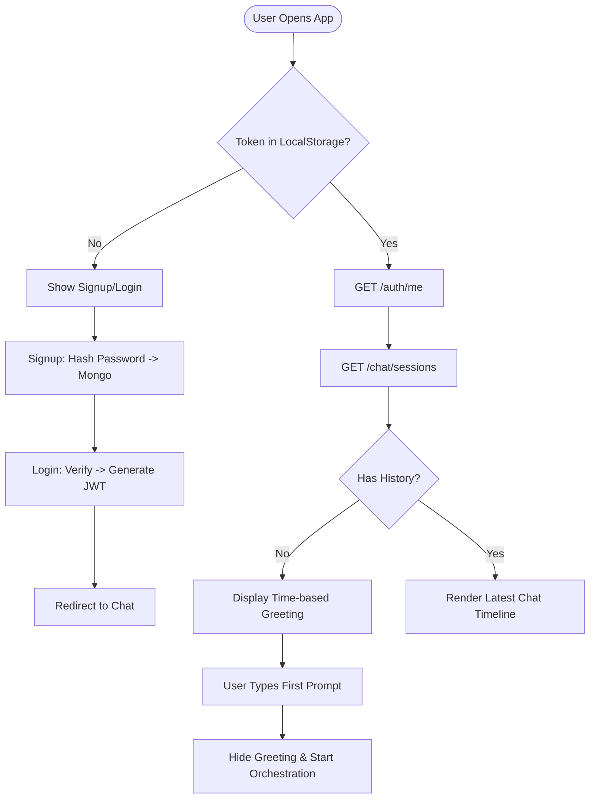

# Koala Behavioral Architecture

This document provides a behavioral overview of how the Koala AI Orchestrator handles user interactions, task decomposition, and data persistence.

## 1. High-Level System Flow

The following diagram illustrates the end-to-end flow from a user entering a prompt to the final orchestrated result being rendered.

```mermaid
sequenceDiagram
    autonumber
    actor User
    participant Frontend as React Frontend
    participant API as FastAPI Backend
    participant DB as MongoDB (Atlas)
    participant AI as Groq (Llama-3 models)

    User->>Frontend: Enter Prompt & Click Send
    Frontend->>API: POST /chat/sessions/{id}/messages
    Note over API: validate JWT & session

    API->>DB: Store User Message
    
    rect rgb(30, 35, 45)
    Note right of API: Orchestration Phase
    API->>AI: Call plan_task(prompt)
    AI-->>API: Returns JSON Plan (Subtasks)
    
    loop For each Subtask
        API->>AI: execute_plan() -> call specific model
        AI-->>API: Subtask Result
    end
    
    API->>AI: merge_results() -> Synthesize Final Output
    AI-->>API: Cohesive Final Response
    end

    API->>DB: Update Session (Push AI Message + Subtasks)
    API-->>Frontend: Return Updated Session JSON
    Frontend->>Frontend: Update React State (messages)
    Frontend-->>User: Render Message Timeline & Execution Plan
```

---

## 2. Authentication & Session Initialization

How users gain access and how the "Time-based Greeting" handles the initial state.

---

## 3. Data Persistence Model (MongoDB)

Behavior of the data layer during user updates.

| Action | Collection | Behavior |
| :--- | :--- | :--- |
| **New Chat** | `chat_sessions` | Creates a new doc with `user_id` and empty `messages`. |
| **Orchestrate** | `chat_sessions` | `$push` user prompt, then `$push` AI response + `subtasks` array. |
| **Update Name** | `users` | `$set` new `display_name`; triggers immediate `AuthContext` update. |
| **Change Theme** | `users` | Persists `theme: "light" \| "dark"`; applied via CSS `data-theme` attribute. |
| **Clear History** | `chat_sessions` | `delete_many({"user_id": current_user_id})` |

---

## 4. Error Handling Behavior

- **Database Disconnect**: Backend returns `500` -> Frontend shows `Session error` in console + keeps input disabled.
- **Incompatible Password**: Handled via direct `bcrypt` hashing (fixed 72-byte limit bug).
- **JSON Serialization**: Handled by manually popping MongoDB `_id` and converting to `id` string before sending to FastAPI.
